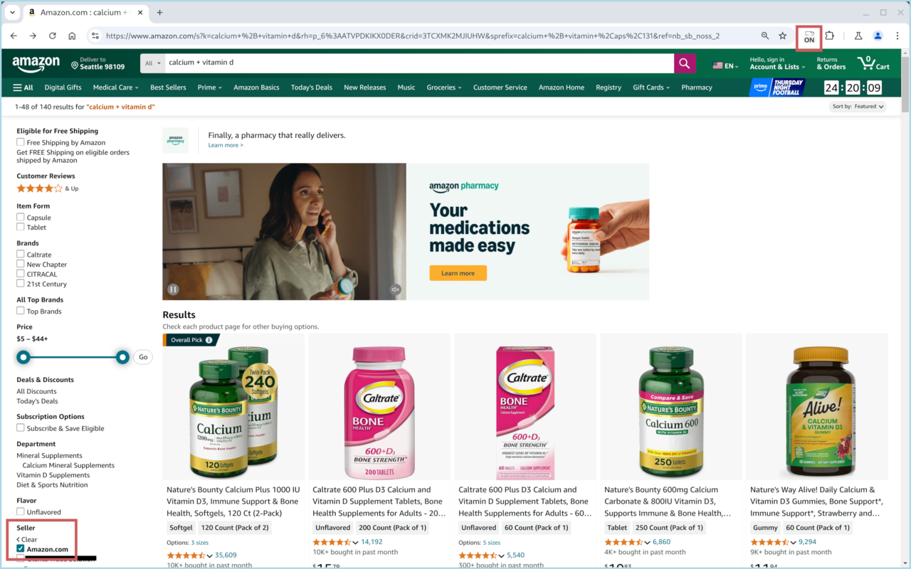

export const description =
  "Shop products sold by e-commerce websites themselves only.";

Top retailer websites such as Amazon are [often embroiled by bogus third-party
sellers selling fake or shoddy
products](https://www.wired.com/story/how-shop-safe-amazon/). It can be even
more harmful if the products are related to personal health.

One way to address is to only shop products sold by the retailer website itself.
This browser extension automatically filters out products sold by third-party
sellers in the search results on these websites. For example, on Amazon, this
extension automatically filters the result to Amazon-sold products only.

## Usage

We recommend [pinning the extension to the browser
toolbar](https://support.scribecount.com/support/solutions/articles/66000526598-steps-to-pin-an-extension-on-the-browser)
because:

- Clicking on the icon of the extension toggles the filtering for the retailer
  website.
- The icon shows whether the filtering is currently on/off for the retailer
  website.

## Screenshots

## Supported Websites

- Amazon
  - [Canada](https://amazon.ca)
  - [France](https://amazon.fr)
  - [Germany](https://amazon.de)
  - [Italy](https://amazon.it)
  - [Japan](https://amazon.co.jp)
  - [Spain](https://amazon.es)
  - [United Kingdom](https://amazon.co.uk)
  - [United States](https://Amazon.com)
- Newegg
  - [Canada](https://newegg.ca)
  - [United States](https://newegg.com)
  - [Global](https://secure.m.newegg.com/myaccount/changecountry)
- [Target](https://www.target.com)
- Walmart
  - [Canada](https://walmart.ca)
  - [United States](https://walmart.com)

## Changelog

### v1.2.0

Support Amazon when subcategory is used, e.g., `https://www.amazon.com/subcategory/s?`.

### v1.1.1

Fix an infinite redirection on some sites when applying another shopping filter.

### v1.1.0

Support various regions for Amazon, Newegg, Target, and Walmart.

### v1.0.0

Initial release.

_Sold by Official is an open source project. If you are interested, feel free to
check out the [source code](https://github.com/8hobbies/sold-by-official)._
